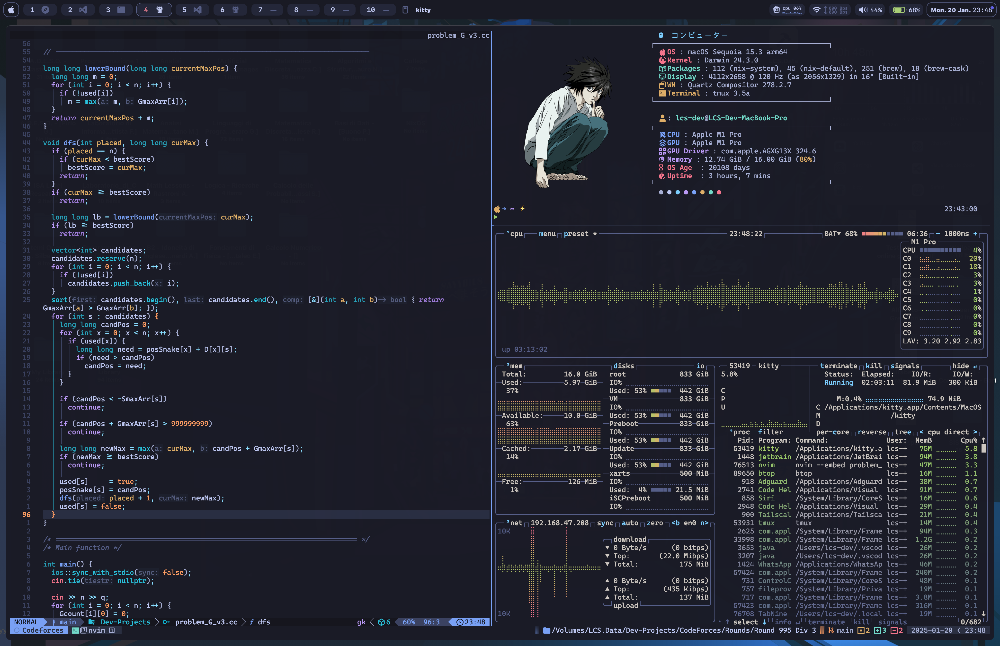

# Dotfiles

This repository contains my personal dotfiles for configuring various tools and applications on macOS and Linux systems. These dotfiles are managed using [GNU Stow](https://www.gnu.org/software/stow/), which simplifies the process of symlinking configuration files.



## Table of Contents

- [Prerequisites](#prerequisites)
- [Installation](#installation)
  - [Clone the Repository](#clone-the-repository)
  - [Using Stow](#using-stow)
- [Directory Structure](#directory-structure)
- [Usage](#usage)
  - [macOS Instructions](#macos-instructions)
  - [Linux Instructions](#linux-instructions)
- [Contributing](#contributing)
- [License](#license)

## Prerequisites

Ensure that you have the following installed on your system:

- [GNU Stow](https://www.gnu.org/software/stow/): Use your system's package manager to install it.
  - **macOS**: `brew install stow`
  - **Linux**: Use your distribution's package manager, e.g., `sudo apt install stow` or `sudo pacman -S stow`.

## Installation

### Clone the Repository

First, clone this repository into your home directory or a directory of your choice:

```bash
cd ~
git clone https://github.com/XtremeXSPC/Dotfiles.git
cd Dotfiles
```

### Using Stow

GNU Stow is used to create symlinks from this repository to your home directory, ensuring that configurations are applied correctly.

## Directory Structure

Each subdirectory in this repository corresponds to a specific tool or application. For example:

```
Dotfiles/
├── kitty/      # Kitty configuration file
├── nvim/       # Neovim configuration files
├── tmux/       # Tmux configuration files
└── zsh/        # Zsh configuration files
```

## Usage

### macOS Instructions

1. Open a terminal and navigate to the `Dotfiles` directory:

   ```bash
   cd ~/Dotfiles
   ```

2. Use Stow to apply configurations for a specific tool. For example, to apply the Neovim configuration:

   ```bash
   stow -v nvim
   ```

   This will create symlinks for the Neovim configuration files in your home directory.

3. Repeat the `stow` command for other tools as needed:

   ```bash
   stow -v tmux
   stow -v zsh
   ```

### Linux Instructions

1. Open a terminal and navigate to the `Dotfiles` directory:

   ```bash
   cd ~/Dotfiles
   ```

2. Use Stow to apply configurations for a specific tool. For example, to apply the Bash configuration:

   ```bash
   stow -v bash
   ```

3. Repeat the `stow` command for other tools as needed:

   ```bash
   stow -v nvim
   stow -v zsh
   ```

### Notes

- If you encounter conflicts with existing files, consider backing them up or removing them before running Stow.
- To remove symlinks created by Stow, use the `-D` option:

  ```bash
  stow -D nvim
  ```

## Contributing

Contributions are welcome! Feel free to open an issue or submit a pull request if you have suggestions for improving this repository.

## License

This repository is licensed under the MIT License. See the [LICENSE](LICENSE) file for details.
