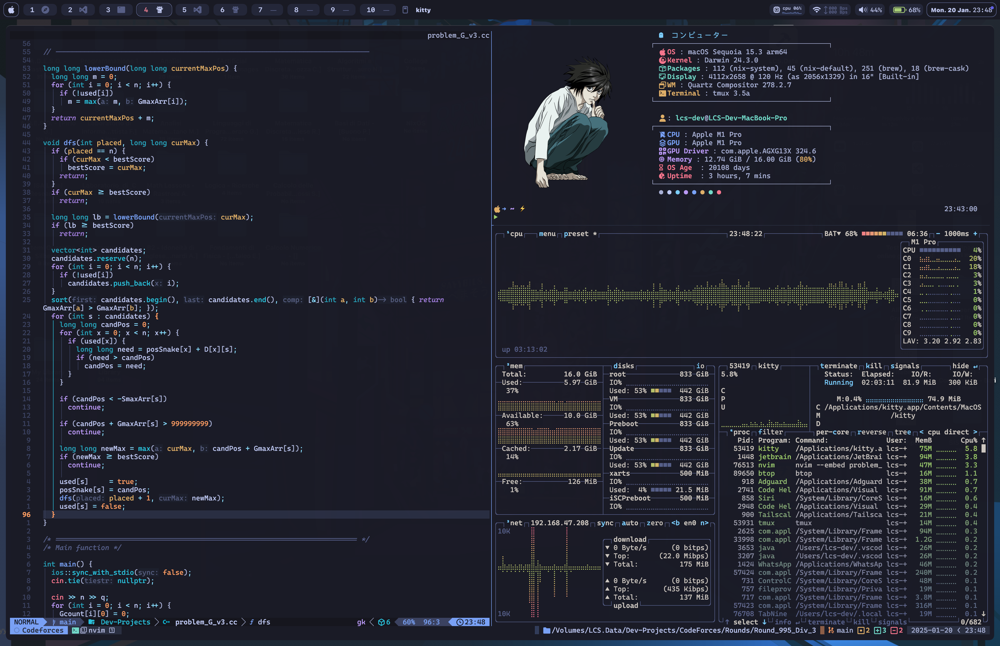

# Dotfiles

Personal dotfiles for macOS and Linux, managed declaratively with [Nix](https://nixos.org/) — [nix-darwin](https://github.com/LnL7/nix-darwin) for system-level macOS configuration and [Home Manager](https://github.com/nix-community/home-manager) for per-application configuration on both platforms. This repo previously used [GNU Stow](https://www.gnu.org/software/stow/) to symlink one package per tool; that workflow has been fully replaced (see [Migrating from GNU Stow](#migrating-from-gnu-stow)).



## Table of Contents

- [Dotfiles](#dotfiles)
  - [Table of Contents](#table-of-contents)
  - [Prerequisites](#prerequisites)
  - [Installation](#installation)
    - [Clone the Repository](#clone-the-repository)
    - [macOS (nix-darwin + Home Manager)](#macos-nix-darwin--home-manager)
    - [Linux (standalone Home Manager)](#linux-standalone-home-manager)
  - [Directory Structure](#directory-structure)
  - [What's Managed Where](#whats-managed-where)
  - [Migrating from GNU Stow](#migrating-from-gnu-stow)
  - [Contributing](#contributing)
  - [License](#license)

## Prerequisites

- [Nix](https://nixos.org/download) with flakes enabled (`experimental-features = nix-command flakes`).
- **macOS**: [nix-darwin](https://github.com/LnL7/nix-darwin) installed.
- **Linux**: [Home Manager](https://github.com/nix-community/home-manager) installed standalone — no NixOS required, the host's own package manager stays responsible for the OS itself.

## Installation

### Clone the Repository

```bash
git clone https://github.com/XtremeXSPC/Dotfiles.git ~/Dotfiles
cd ~/Dotfiles
```

### macOS (nix-darwin + Home Manager)

Validate first — this only evaluates and builds, it never touches the live system:

```bash
darwin-rebuild build --flake .#LCSMacBook-Pro --impure
```

`--impure` is required: nix-darwin reads real macOS account state (`system.primaryUser`, the account's home directory) that a pure evaluation can't see. Once the build is clean, activate it:

```bash
sudo darwin-rebuild switch --flake .#LCSMacBook-Pro --impure
```

This applies every Home Manager-managed dotfile, the declared Homebrew inventory (taps/casks/formulae), and the Dock/Finder/trackpad system defaults, and reruns on every subsequent switch.

### Linux (standalone Home Manager)

```bash
home-manager switch --flake '.#lcs-dev@lcs-legion-arch'
```

Only one Linux host is currently defined (`lcs-legion-arch`, Arch Linux, `x86_64-linux`), and it is **written but unverified** — there is no physical or remote access to actually build or switch it yet. Treat it as a structural reference, not a confirmed-working config.

## Directory Structure

```dir
Dotfiles/
├── flake.nix              # Flake entry point: darwin + home-manager outputs
├── flake.lock
├── hosts/
│   ├── LCSMacBook-Pro/
│   │   ├── darwin.nix     # Host-specific: stateVersion, hostPlatform
│   │   └── home.nix       # Host-specific: username, homeDirectory, imports
│   └── lcs-legion-arch/
│       └── home.nix       # Same shape, for the Linux host
├── darwin/
│   ├── default.nix        # Shared nix-darwin config: nix.gc, system.defaults, users
│   └── homebrew.nix       # Declarative Homebrew: taps, casks, formulae
└── home/
    ├── default.nix        # Aggregator: stateVersion + imports for every app below
    ├── git/                # One folder per tool, each with its own default.nix
    ├── zsh/
    └── ...                 # kitty, neovim, tmux, starship, fish, nushell, etc.
```

Each application's Nix glue and its actual config content live together in the same folder, rather than mirroring `$HOME`'s layout the way the old Stow packages did.

## What's Managed Where

- **`darwin/`** — system-level, macOS only: Homebrew inventory, Dock/Finder/trackpad defaults, Nix garbage collection, and the account mapping Home Manager needs.
- **`home/`** — per-application Home Manager modules, shared across both hosts where a tool exists on both platforms. Platform-specific behavior is gated with `lib.mkIf pkgs.stdenv.isDarwin` / `pkgs.stdenv.isLinux` inside the shared module rather than duplicated per host.
- **zsh is config-only**: everything under `home/zsh/` is Nix/Home Manager-managed, but the `zsh` binary itself is still Homebrew-managed for now — a deliberate, staged decision.

## Migrating from GNU Stow

This repo used to be one GNU Stow package per tool (`zsh/`, `kitty/`, `nvim/`, ...), each mirroring `$HOME`'s layout so `stow <package>` could symlink it in. That workflow, including the old Stow scaffolding scripts, has been fully retired in favor of the Nix/Home Manager structure above. If you're looking at an older clone or fork that still uses Stow, it predates this migration.

## Contributing

Contributions are welcome! Feel free to open an issue or submit a pull request if you have suggestions for improving this repository.

## License

This repository is licensed under the MIT License. See the [LICENSE](LICENSE) file for details.
